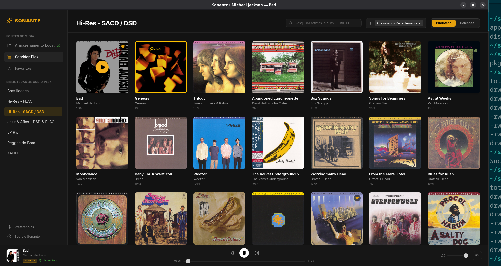
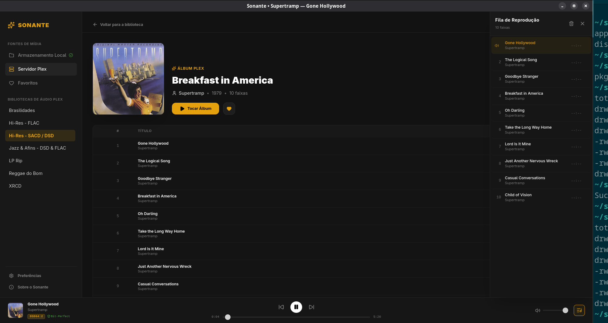
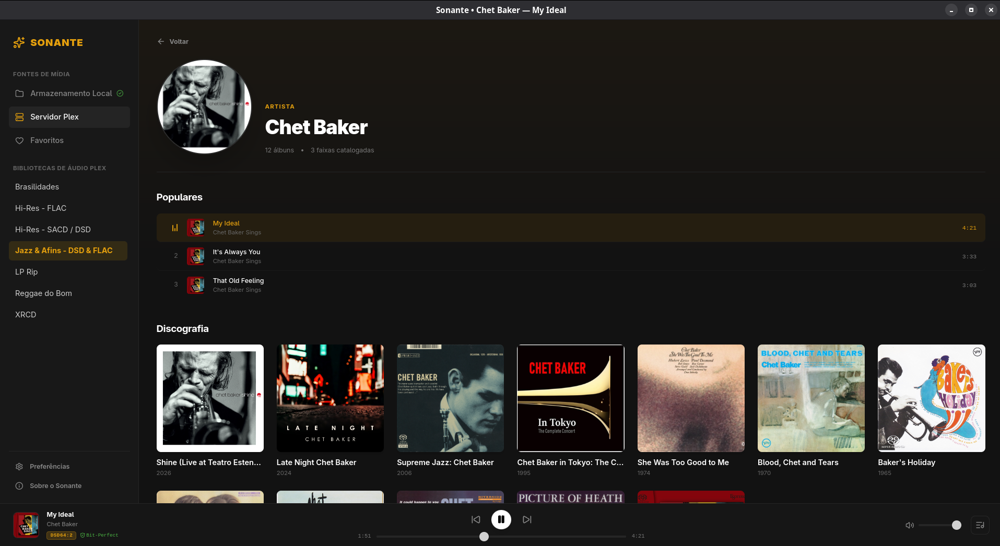

<div align="center">

# Sonante

**Desktop Audio Player for Linux**

*ALSA Direct and Shared Audio output, local libraries, and Plex Media Server integration.*

[](https://github.com/tiagoalam/sonante/releases)
[-blue?style=flat-square)](#requirements)
[](#architecture)
[](#architecture)
[](#audiophile-audio-engine)
[](#license)

</div>

---

## Overview

**Sonante** is a desktop music player for Linux offering a choice between **ALSA Direct** and **Shared Audio**:

* **ALSA Direct:** Points MPD to the selected ALSA hardware endpoint, normally `hw:CARD=...,DEV=...`. A hardware endpoint alone does not confirm bit-for-bit integrity, absence of conversion, or the format effectively received by the DAC.
* **Shared Audio (PipeWire / PulseAudio / ALSA dmix):** Routes audio through the system's `default` ALSA endpoint. Coexistence and any mixing or resampling behavior depend on the host audio configuration.

Sonante unifies offline high-resolution collections (spanning internal disks and external drives) and remote **Plex Media Server** audio libraries under an elegant, responsive dark interface.

---

## What's New in v0.3.8

* **Dual-Mode Audio Engine Architecture:** Distinct separation between **ALSA Direct** (selected hardware endpoint with optional MPD DoP configuration) and **Shared Audio** (`default` ALSA endpoint for system-managed output).
* **Hardware Lock Prevention & Resilient Daemon Teardown:** Uses owned-process validation, socket teardown, `Drop` cleanup, and explicit shutdown paths to release the DAC without signaling unrelated processes from stale PID files.
* **Deterministic Audio Handover:** Dynamic device switching preserves the queue, selected track, and playhead position when possible. Playing and Paused sessions finish the switch paused for manual resume; Stopped sessions remain stopped without autoplay.
* **Refined Plex Navigation Stack:** Fixed navigation precedence in the artist view, allowing discography album cards to act as responsive links opening the album view while preserving back-stack history.
* **Interactive First-Run Wizard:** Full bilingual onboarding flow with instant audio mode selection, directory mapping, and OAuth PIN login.

---

## Screenshots

<p align="center">
  
  <br><em>Browsing Hi-Res / SACD library with real-time filters and responsive album grid.</em>
</p>

<p align="center">
  
  
  <br><em>Left: Album tracklist with slide-out Queue Drawer | Right: Full artist discography and top tracks.</em>
</p>

## Key Features

### 🔊 Audio Output Architecture

Sonante v0.3.8 introduces a dedicated dual-mode audio architecture designed to seamlessly accommodate both critical listening and daily desktop workflows:

* **ALSA Direct:**
  * Points MPD to a selected ALSA hardware endpoint, normally `hw:CARD=...,DEV=...`.
  * Can request **DSD over PCM (DoP)** from MPD. Effective operation depends on compatible MPD, ALSA, and DAC behavior.
  * The format reported by MPD describes its playback state; it does not by itself confirm the format delivered through ALSA or received by the DAC.
  * Uses controlled shutdown and owned-process validation to release the MPD process and its audio resources safely.

* **Shared Audio (PipeWire / PulseAudio / ALSA dmix):**
  * Routes MPD through the standard `default` ALSA endpoint.
  * Is intended to coexist with browsers, communication tools, games, and desktop notifications when supported by the host audio configuration.
  * Mixing, resampling, device sharing, and compatibility are controlled by the system's ALSA/PipeWire/PulseAudio setup.

### Plex Media Server Integration
* **Official OAuth / PIN Authentication:** Web-based login with polling and secure local token storage.
* **LAN Auto-Discovery & Direct Play:** Automatically detects whether the server is local or remote, prioritizing local network IP routes for maximum throughput.
* **Media-Part Streaming:** Passes Plex media-part URIs to MPD; decoding and output depend on MPD and the configured audio path.
* **Unified Remote Navigation:** Browse Plex Music Libraries, Collections, Artist Discographies, and perform fast instant search with debounced indexing.

### Local Music Management
* **Multi-Directory Aggregation:** Merge arbitrary local folders, internal disks, and external USB drives under a unified symlink structure.
* **Album Deduplication:** Consolidates loose audio files into organized album collections.
* **LRU Caching & Lazy Loading:** Visual artwork is lazily loaded using an `IntersectionObserver` coupled with an in-memory Least-Recently-Used (LRU) cover cache to minimize RAM consumption.

### UI & User Experience
* **Interactive PlayerBar:** Instant navigation back to current artists and albums directly from playback controls.
* **Fully Internationalized (i18n):** Native support for **English (en-US)** and **Portuguese (pt-BR)** with real-time switching across the entire UI.
* **Interactive First-Run Wizard:** Guides the user through audio output selection (ALSA Direct or Shared Audio), local library setup, and Plex connection.
* **Unified Favorites:** Persistent favorites system across both local albums and Plex libraries with active offline availability tracking.
* **Global Keyboard Shortcuts:** Fast control for common playback, volume, and search actions.

---

## Architecture

```text
+-----------------------------------------------------------------+
|                    Frontend (React 18 + Vite)                   |
|       Lucide Icons  *  Tailwind CSS  *  react-i18next (pt/en)   |
+--------------------------------+--------------------------------+
                                 | IPC (Tauri Core Invokes)
+--------------------------------v--------------------------------+
|                       Tauri / Rust Backend                      |
|  - HTTP Connection Pooling with Keep-Alive (reqwest)            |
|  - Atomic Configuration Persistence (fs::rename)                |
|  - MPD Process Supervisor & Dynamic mpd.conf Generation         |
|  - Mirrored Queue Metadata Cache (queue_cache.json)             |
+--------------------------------+--------------------------------+
                                 | UNIX Domain Socket
+--------------------------------v--------------------------------+
|                    Dedicated MPD Audio Daemon                   |
|          Configured for ALSA Direct or Shared Audio Output     |
+--------------------------------+--------------------------------+
                                 |
        +------------------------+------------------------+
        |                                                 |
        | ALSA Direct / optional MPD DoP request          | Shared Audio
+-------v-------------------------+     +-----------------v---------------+
|   External Audiophile USB DAC   |     |    PipeWire / PulseAudio Server |
|   Direct Hardware (hw:CARD,DEV) |     |    System Mixed Output (default)|
+---------------------------------+     +---------------------------------+

```

---

## Installation & Distribution

Pre-built binaries are available in the [GitHub Releases](https://github.com/tiagoalam/sonante/releases) page.

### 1. Arch Linux / Manjaro
Install via the pre-compiled package or build using `makepkg`:

```bash
# Using your preferred AUR helper
yay -S sonante-bin
# or paru
paru -S sonante-bin
```

### 2. Debian / Ubuntu / Linux Mint (`.deb`)
Download the latest `.deb` package from Releases and install via `dpkg`:

```bash
sudo dpkg -i sonante_*_amd64.deb
sudo apt-get install -f # Resolve dependencies if needed
```

### 3. Universal Linux (`.AppImage`)
Download the `.AppImage`, make it executable, and run:

```bash
chmod +x sonante_*_amd64.AppImage
./sonante_*_amd64.AppImage
```

---

## Keyboard Shortcuts

| Shortcut | Description |
| :--- | :--- |
| **Space** | Play / Pause playback |
| **Right Arrow** | Next track |
| **Left Arrow** | Previous track |
| **Up Arrow** | Increase volume (+5%) |
| **Down Arrow** | Decrease volume (-5%) |
| **M** | Mute / Unmute |
| **Ctrl + F** | Focus global search bar |
| **Esc** | Close active modals / Queue drawer / Clear search |

---

## Building from Source

### Prerequisites

Ensure you have the following system libraries installed on your machine:

**Debian / Ubuntu:**
```bash
sudo apt update
sudo apt install -y build-essential curl wget file libssl-dev libgtk-3-dev libayatana-appindicator3-dev librsvg2-dev libasound2-dev mpd
```

**Arch Linux / Manjaro:**
```bash
sudo pacman -S --needed base-devel curl wget openssl gtk3 libayatana-appindicator librsvg alsa-lib mpd
```

### Build Instructions

1. Clone the repository:
```bash
git clone [https://github.com/tiagoalam/sonante.git](https://github.com/tiagoalam/sonante.git)
cd sonante
```

2. Install frontend dependencies:
```bash
npm install
```

3. Run in development mode:
```bash
npm run tauri dev
```

4. Build production packages:
```bash
npm run tauri build
```
Binaries and bundles will be placed in `src-tauri/target/release/bundle/`.

---

## Application Paths

Sonante keeps persistent data in the user configuration directory and transient process endpoints in the per-user runtime directory:

* `~/.config/sonante/config.json` — Hardware preferences, buffers, and Plex session tokens.
* `~/.config/sonante/favorites.json` — Unified favorites registry.
* `~/.config/sonante/queue_cache.json` — Mirrored queue metadata cache; it does not persist MPD playback state.
* `~/.config/sonante/mpd.conf` — Dynamically generated MPD configuration.
* `$XDG_RUNTIME_DIR/sonante/mpd.socket` — Dedicated per-user MPD UNIX IPC control socket.
* `$XDG_RUNTIME_DIR/sonante/mpd.pid` — PID file for the owned MPD process.
* When `XDG_RUNTIME_DIR` is unavailable, both runtime files use the private `runtime/sonante/` subdirectory inside the Sonante configuration directory.
* `~/.config/sonante/library/` — Symlinked virtual directory mirroring all local library roots.

---

## License

Copyright (c) 2026 - present Tiago Alam. All rights reserved.

**Sonante is Free-to-Use Software (Source-Available):**
* You are free to download, install, build, and use this software on your personal machines at no cost.
* You may inspect and audit the source code for personal and security verification.
* **Restrictions:** You may **not** redistribute, sell, sub-license, host as a paid service, or republish full or substantial copies/derivatives of this project, its branding, or its compiled binaries without prior written authorization from the author.
